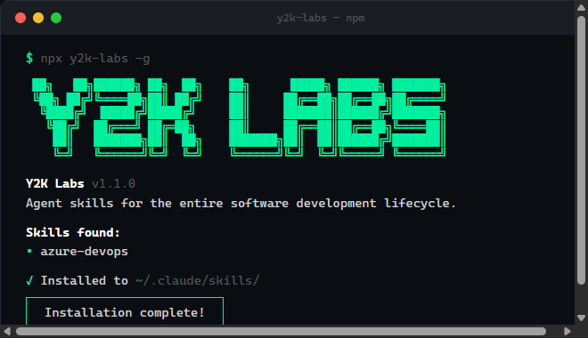

# po-skills

<p align="center">
  
</p>

<p align="center">
  Product Owner agent skills for Azure DevOps. Reads documents and creates full backlogs automatically.
</p>

<p align="center">
  Built on the <a href="https://agentskills.io/specification">Agent Skills</a> open standard. Works with <strong>Claude Code, Cursor, GitHub Copilot, Windsurf, Cline</strong>, and <a href="https://github.com/vercel-labs/skills">40+ AI agents</a>.
</p>

<p align="center">
  <a href="https://www.npmjs.com/package/po-skills"></a>
  <a href="https://www.npmjs.com/package/po-skills"></a>
  <a href="https://github.com/GusY2K/po-skills/stargazers"></a>
  <a href="https://github.com/GusY2K/po-skills"></a>
</p>

---

## Install

```bash
npx skills add -g GusY2K/po-skills
```

> **Project-only** (not global):
> ```bash
> npx skills add GusY2K/po-skills
> ```

### Other install methods

<details>
<summary>Install a specific skill only</summary>

```bash
npx skills add -g GusY2K/po-skills@azure-devops-backlog-creator
```
</details>

<details>
<summary>Manual install (symlink)</summary>

```bash
# Clone
git clone https://github.com/GusY2K/po-skills.git

# Global — available in all projects
mkdir -p ~/.claude/skills
ln -s "$(pwd)/po-skills/skills/azure-devops-backlog-creator" ~/.claude/skills/azure-devops-backlog-creator

# Project-only
mkdir -p .claude/skills
ln -s "$(pwd)/po-skills/skills/azure-devops-backlog-creator" .claude/skills/azure-devops-backlog-creator
```
</details>

<details>
<summary>Windows (no symlinks)</summary>

```bash
npx skills add -g GusY2K/po-skills --copy
```

Or manually copy the `skills/azure-devops-backlog-creator/` folder into `%USERPROFILE%\.claude\skills\`.
</details>

### Verify

Start a new Claude Code session and type `/` — you should see `azure-devops-backlog-creator` in the list.

---

## Update

```bash
# Update to latest version (re-runs the installer with newest skills)
npx po-skills@latest -g
```

## Manage

If you also use the `skills` CLI (Vercel), these commands work too:

```bash
# List installed skills
npx skills list
npx skills ls -g          # global only

# Remove
npx skills remove azure-devops-backlog-creator
npx skills rm -g azure-devops-backlog-creator   # global
```

---

## Skills

### azure-devops-backlog-creator

Reads any document (PRD, spec, markdown, feature brief, meeting notes) and creates a complete Azure DevOps backlog: **Epics → Features → User Stories → Tasks → Bugs**, with parent-child links, acceptance criteria, story points, and tags.

#### Invocation

**Option A — Slash command:**
```
/azure-devops-backlog-creator path/to/document.md
```

**Option B — Natural language (auto-detected):**
> "Read this PRD and create the epics and user stories in Azure DevOps"
>
> "Generate the backlog from this spec"
>
> "Create work items from this requirements doc"

Claude detects intent automatically — no slash command needed.

#### Arguments

```
/azure-devops-backlog-creator <document> [options]
```

| Argument | Description | Default |
|----------|-------------|---------|
| `<document>` | Path to the requirements document | **Required** |
| `--org=<name>` | Azure DevOps organization | `az devops` default |
| `--project=<name>` | Azure DevOps project | `az devops` default |
| `--type=<template>` | Process template: `agile`, `scrum`, `basic` | `agile` |
| `--iteration=<path>` | Sprint/iteration path | Current iteration |
| `--area-path=<path>` | Area path | Project root |
| `--assign-to=<email>` | Default assignee | Unassigned |
| `--tags=<t1,t2>` | Extra tags on all items | None |
| `--priority=<1-4>` | Default priority | `2` |
| `--output=<file>` | Save plan to .md file for review | None (shows in chat) |
| `--dry-run` | Preview plan without creating | `false` |

#### Examples

```bash
# Basic — read a PRD, create everything
/azure-devops-backlog-creator docs/auth-prd.md

# Scrum template, specific sprint
/azure-devops-backlog-creator spec.md --type=scrum --iteration="Sprint 5"

# Dry run — see what would be created
/azure-devops-backlog-creator requirements.md --dry-run

# Save plan to file for review before creating
/azure-devops-backlog-creator spec.md --output=backlog-plan.md

# Full options
/azure-devops-backlog-creator feature.md --org=myorg --project=MyApp --assign-to=dev@company.com --tags=mvp,backend --priority=2
```

#### How it works

```
1. READ        Parse document → extract hierarchy (Epics, Features, Stories, Tasks, Bugs)
2. PLAN        Ask: show in chat, save to .md file, or both?
3. REVIEW      You review the plan (edit the .md file if needed)
4. CONFIRM     Nothing touches Azure until you say yes
5. CREATE      Top-down creation with az boards CLI → parent-child links established
6. VERIFY      Count check + hierarchy validation → all items linked correctly
7. REPORT      Summary table with IDs + direct links to your Azure board
```

Every session tags all items with `backlog-creator-YYYYMMDD-HHMMSS` for easy querying and rollback.

#### Process templates

| Template | Flag | Epic | Mid-level | Requirement | Task | Bug |
|----------|------|------|-----------|-------------|------|-----|
| Agile | `--type=agile` | Epic | Feature | User Story | Task | Bug |
| Scrum | `--type=scrum` | Epic | Feature | Product Backlog Item | Task | Bug |
| Basic | `--type=basic` | Epic | Issue | Issue | Task | Issue |

#### Rollback

```bash
# Preview what would be deleted
bash scripts/rollback.sh backlog-creator-20260317-143022

# Delete all items from that session
bash scripts/rollback.sh backlog-creator-20260317-143022 --confirm
```

#### Supported documents

- `.md` — PRDs, specs, feature briefs, design docs
- `.txt` — Meeting notes, requirements lists
- Any text file Claude Code can read

---

## Prerequisites

| # | Requirement | Install |
|---|-------------|---------|
| 1 | Azure CLI | [Install guide](https://learn.microsoft.com/en-us/cli/azure/install-azure-cli) |
| 2 | DevOps extension | `az extension add --name azure-devops` |
| 3 | Authentication | `az login` or set `AZURE_DEVOPS_EXT_PAT` env var |
| 4 | Defaults | `az devops configure --defaults organization=https://dev.azure.com/ORG project=PROJECT` |

Quick check:
```bash
bash scripts/validate-prerequisites.sh myorg myproject
```

---

## Team setup

### One-liner for everyone

```bash
npx skills add -g GusY2K/po-skills
```

### Lock to project (auto-install for new contributors)

```bash
npx skills add GusY2K/po-skills
git add skills-lock.json .claude/skills/
git commit -m "chore: add PO skills for Azure DevOps"
```

New contributors run `npx skills install` to restore all locked skills.

---

## Compatibility

Works with any AI agent that supports the [Agent Skills standard](https://agentskills.io/specification):

Claude Code, Cursor, GitHub Copilot, Windsurf, Cline, CodeBuddy, Aider, Continue, OpenCode, Zed, and [30+ more](https://github.com/vercel-labs/skills#supported-agents).

---

## Contributing

1. Fork this repo
2. Add or modify skills in `skills/`
3. Each skill needs a `SKILL.md` with YAML frontmatter (`name` + `description`)
4. Update `.claude-plugin/marketplace.json` if adding new skills
5. Submit a PR

### Create a new skill

```bash
npx skills init my-new-skill
```

---

## License

Apache-2.0 — see [LICENSE.txt](./LICENSE.txt)
